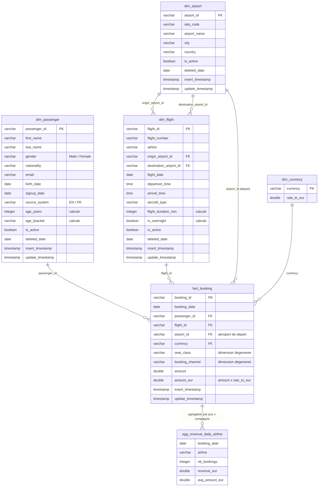
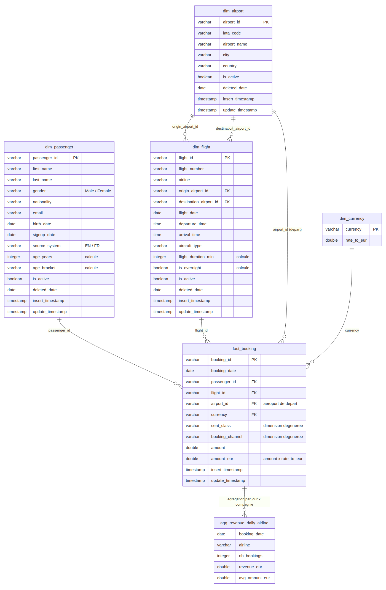

# Documentation — Ingestion et modélisation des données d'une compagnie aérienne

## 1. Vue d'ensemble

Le pipeline suit l'architecture médaillon demandée, avec un script par entité
(`ingestion/ingest_<entité>.py`) et trois fonctions par script :

| Couche | Fonction | Ce qu'elle fait | Où ça vit |
|---|---|---|---|
| Bronze | `ingest_bronze(day, init)` | Télécharge le CSV brut du jour une seule fois et le stocke tel quel | `bronze/<subdir>/<fichier>.csv` |
| Silver | `ingest_silver(day, init)` | Relit le fichier bronze, nettoie/harmonise, charge dans une table typée avec la stratégie adaptée (upsert ou insert) | `warehouse.duckdb`, tables `silver_*` |
| Gold | `ingest_gold()` | Reconstruit le modèle dimensionnel à partir de l'état courant du silver, en ajoutant les attributs calculés | `warehouse.duckdb`, tables `dim_*`, `fact_*`, `agg_*` |

Chaque fonction ne lit que ce que la précédente a persisté (fichier sur disque, puis table silver) :
aucun DataFrame n'est passé d'une fonction à l'autre. `ingestion/run_month.py` (fourni) rejoue
l'init puis les 30 jours de septembre 2025 dans l'ordre bronze → silver → gold pour les 4 entités.

Exécution complète depuis un clone propre (environ 1 minute, le temps de télécharger les 155 fichiers) :

```bash
python3 -m venv venv
source venv/bin/activate
pip install -r requirements.txt
python3 ingestion/run_month.py
```

## 2. Ce que l'exploration des fichiers m'a appris

Avant d'écrire le pipeline, j'ai comparé `init/` et les premiers fichiers journaliers de
`2025-09/` avec pandas. Ces observations ont dicté tous les choix qui suivent.

| Question | Réponse | Conséquence |
|---|---|---|
| Clé unique par fichier ? | `airport_id`, `flight_id`, `passenger_id` / `id_passager`, `booking_id`. Toutes uniques dans chaque fichier, vérifié. | Clés primaires des tables silver. |
| Historique complet ou nouveautés du jour ? | `airports`, `flights`, `passengers_en/fr` : **extrait complet** chaque jour (ex. 350 vols dans init, 349 le 1er septembre). `bookings` : **uniquement les réservations du jour** (400 en août dans init, puis 900 à 1 500 par jour, aucun `booking_id` commun entre deux jours). | Les référentiels se chargent en upsert par comparaison avec l'existant ; les réservations s'ajoutent simplement. |
| Fréquence des changements ? | Aéroports : quasi figés (1 ajout, 1 correction sur le mois). Vols : 0 à 3 évènements par jour, dont des **disparitions** (ex. 1er septembre : 1 vol ajouté, 2 disparus). Passagers : croissance quotidienne, corrections occasionnelles, rares disparitions. | Les lignes disparues ne sont jamais supprimées mais **désactivées** (`is_active = false`, `deleted_date`). |
| Évènements immuables ou référentiel qui évolue ? | Les réservations sont des évènements datés, jamais modifiés. Les trois autres décrivent le contexte d'une réservation et évoluent dans le temps. | `bookings` → table de fait ; `airports`, `flights`, `passengers` → dimensions. |
| `passengers_en` et `passengers_fr` au même format ? | Non : noms de colonnes différents, genre `Male/Female` vs `Homme/Femme`, dates `YYYY-MM-DD` vs `DD/MM/YYYY`. Les identifiants ne se chevauchent pas. | Harmonisation vers un schéma unique avant chargement dans une seule table `silver_passengers`. |

Deux points non écrits dans les README, découverts dans les données :

- **99 vols sur 350** (init) ont une `arrival_time` inférieure à la `departure_time` (ex. 15:30 →
  03:41). Ce sont des vols de nuit qui passent minuit, pas des erreurs : la durée doit être
  corrigée de 24 h dans ce cas.
- Le champ `airport_id` d'une réservation est toujours égal à l'`origin_airport_id` du vol réservé
  (0 écart sur les 36 597 réservations) : c'est l'aéroport de départ.

## 3. Modèle dimensionnel (gold)

Schéma en étoile : une table de fait au grain « une réservation », entourée de dimensions.



*(GitHub affiche ce diagramme directement ; il est écrit en Mermaid dans ce fichier. Version image : [`docs/data_model.png`](docs/data_model.png).)*



### Pourquoi `bookings` est le fait et les trois autres des dimensions

Une réservation est un **évènement** : elle a une date, un montant (la mesure que l'on veut
sommer), et elle référence un passager, un vol, un aéroport et une devise. Une fois créée elle ne
change plus. C'est exactement la définition d'une table de fait. À l'inverse, un vol, un passager
ou un aéroport n'ont pas de mesure à additionner : ils **décrivent** la réservation (qui, quoi,
d'où) et leurs attributs peuvent changer dans le temps — ce sont des dimensions.

`seat_class` et `booking_channel` restent dans le fait comme **dimensions dégénérées** : quatre
valeurs chacune, aucun attribut supplémentaire à décrire, une table à part n'apporterait qu'une
jointure de plus.

### Attributs calculés en gold (les dimensions ne sont pas une recopie du silver)

| Table | Attribut | Règle de calcul |
|---|---|---|
| `dim_flight` | `flight_duration_min` | `arrival_time − departure_time` en minutes ; **+ 1 440 min si l'arrivée est avant le départ** (vol de nuit). Hypothèse : aucun vol ne dure plus de 24 h. |
| `dim_flight` | `is_overnight` | `arrival_time < departure_time` (107 vols sur 370 en fin de mois). |
| `dim_passenger` | `age_years` | Âge exact (jour et mois compris) au **30/09/2025**, fin de la période simulée. Une date de référence fixe rend le résultat reproductible : calculé par rapport à « aujourd'hui », l'âge changerait à chaque exécution. |
| `dim_passenger` | `age_bracket` | `<18`, `18-24`, `25-34`, `35-44`, `45-54`, `55-64`, `65+` (découpage marketing classique). |
| `fact_booking` | `amount_eur` | `ROUND(amount × dim_currency.rate_to_eur, 2)` via jointure sur `currency`. |

### Table d'agrégation

`agg_revenue_daily_airline` : chiffre d'affaires en EUR, nombre de réservations et panier moyen
par **jour de réservation × compagnie**. Elle est construite dans `ingest_gold()` des réservations,
juste après `fact_booking`, parce qu'elle dépend de `fact_booking` **et** de `dim_flight` (pour la
compagnie) : dans `run_month.py`, le gold des réservations est exécuté en dernier, donc `dim_flight`
est déjà à jour à ce moment-là. Elle est entièrement recalculée à chaque exécution.

## 4. Stratégie de chargement par entité (insert ou upsert ?)

| Entité | Nature | Stratégie silver | Pourquoi |
|---|---|---|---|
| `airports` | Référentiel quasi figé | **Upsert** (`INSERT … ON CONFLICT (airport_id) DO UPDATE`) + désactivation des clés absentes | Fourni comme modèle. Même si les changements sont rares, une correction de nom (il y en a une dans le mois) doit être répercutée. |
| `flights` | Référentiel qui change souvent | **Upsert** + désactivation | Modifications d'horaire/avion sur un `flight_id` existant → mise à jour ; vols disparus → `is_active = false`. Un simple insert créerait des doublons ou ignorerait les corrections. |
| `passengers` | Référentiel en croissance | Harmonisation EN/FR puis **upsert** + désactivation | Nouveaux passagers chaque jour, corrections d'email ou de nom sur un id existant, rares disparitions. |
| `bookings` | Évènements immuables | **Insert** (`INSERT … ON CONFLICT (booking_id) DO NOTHING`) | Une réservation ne change jamais et le fichier du jour ne contient que les nouveautés : rien à mettre à jour, rien à désactiver. Le `DO NOTHING` sert uniquement à rendre le rejeu d'un jour idempotent. |

### Suppressions : désactivation, jamais de `DELETE`

Quand un vol ou un passager disparaît du fichier du jour, la ligne passe à `is_active = false` et
`deleted_date` prend la date du snapshot où la disparition a été constatée. Elle n'est jamais
supprimée physiquement : à la fin du mois, **520 réservations** portent sur l'un des 10 vols
désactivés. Les supprimer casserait la jointure `fact_booking → dim_flight` et ferait disparaître ce
chiffre d'affaires des analyses. Les analyses qui veulent l'état « courant » filtrent simplement sur
`is_active = true` (cf. requête 8 dans `sql/analysis/queries_analyse.sql`).

### Unification des passagers EN / FR

Le schéma cible est celui du fichier anglais. Dans `ingest_silver` des passagers :
renommage des colonnes FR (`id_passager → passenger_id`, `prenom → first_name`, …), `Homme/Femme
→ Male/Female`, conversion des dates `DD/MM/YYYY` avec le format donné explicitement à pandas
(pour que `08/01/1964` soit bien le 8 janvier), puis empilement des deux sources. Une colonne
`source_system` (`EN`/`FR`) garde la provenance de chaque ligne pour la traçabilité. La couche
bronze, elle, conserve les deux fichiers bruts séparés.

### Colonnes techniques

Sur toutes les tables silver et gold : `insert_timestamp` (première apparition de la ligne, jamais
modifié) et `update_timestamp` (rafraîchi à chaque upsert ou désactivation). Elles suivent en gold
via `SELECT *`. Pour `fact_booking` elles sont toujours égales (une réservation n'est jamais
retouchée) ; pour la table d'agrégation, recalculée intégralement, elles datent de la dernière
reconstruction.

## 5. Validation effectuée

- `run_month.py` complet sans erreur : 81 aéroports (80 + 1 ajouté), 370 vols (360 actifs, 10
  désactivés), 2 239 passagers (1 115 EN + 1 124 FR, 3 désactivés), 36 597 réservations
  (400 d'août + 36 197 de septembre).
- Intégrité référentielle : 0 réservation sans vol, sans passager ou sans aéroport dans les
  dimensions ; 0 réservation dont `airport_id` diffère de l'aéroport d'origine du vol.
- Idempotence : rejouer une seconde fois le dernier jour ingéré ne change aucune ligne (mêmes
  effectifs, mêmes `deleted_date`, mêmes `insert_timestamp`).
- Les 9 requêtes d'analyse de `sql/analysis/queries_analyse.sql` (CA par mois et devise, top
  compagnies, classes de cabine, jour de semaine, top aéroports de départ, évolution quotidienne,
  CA normalisé en EUR, durée moyenne par compagnie, CA par tranche d'âge) s'écrivent chacune avec
  au plus une jointure sur le modèle et renvoient des résultats cohérents.

## 6. Limites connues

- **Pas d'historique des versions** : le silver ne garde que la dernière valeur connue de chaque
  vol ou passager. On sait qu'un vol a changé (`update_timestamp`) mais pas ce qu'il valait avant.
  Une historisation SCD2 (période de validité par version) répondrait à « quel avion était affecté
  à ce vol le 10 septembre ? ».
- **`update_timestamp` est rafraîchi à chaque passage** même si aucune valeur n'a changé (pattern
  du script fourni) : il indique « ligne vue dans le dernier snapshot », pas « ligne réellement
  modifiée ». Une comparaison colonne à colonne avant le `DO UPDATE` corrigerait cela.
- **Les jours doivent être rejoués dans l'ordre chronologique** : l'état d'une dimension est celui
  du dernier snapshot appliqué. Rejouer un jour ancien après un jour plus récent « remonterait le
  temps » (désactivation de lignes créées depuis). Rejouer le même jour ou le dernier jour est sans
  effet, ce qui est le cas d'usage réel d'une reprise.
- **Taux de change fixes** (fournis) : `amount_eur` n'est pas un montant historique exact.
- **Âge à date fixe** (30/09/2025) : choix de reproductibilité, à adapter si le pipeline tournait
  en production réelle (âge à la date de réservation, calculé dans le fait).
- **Pas de dimension date** : les analyses par mois ou jour de semaine utilisent les fonctions de
  date de DuckDB sur `booking_date`, ce qui suffit ici ; une `dim_date` faciliterait des calendriers
  métier (jours fériés, saisons).
- **Vols de plus de 24 h** non représentables avec des heures seules ; hypothèse assumée qu'il n'y
  en a pas (durée maximale observée : 778 min).
