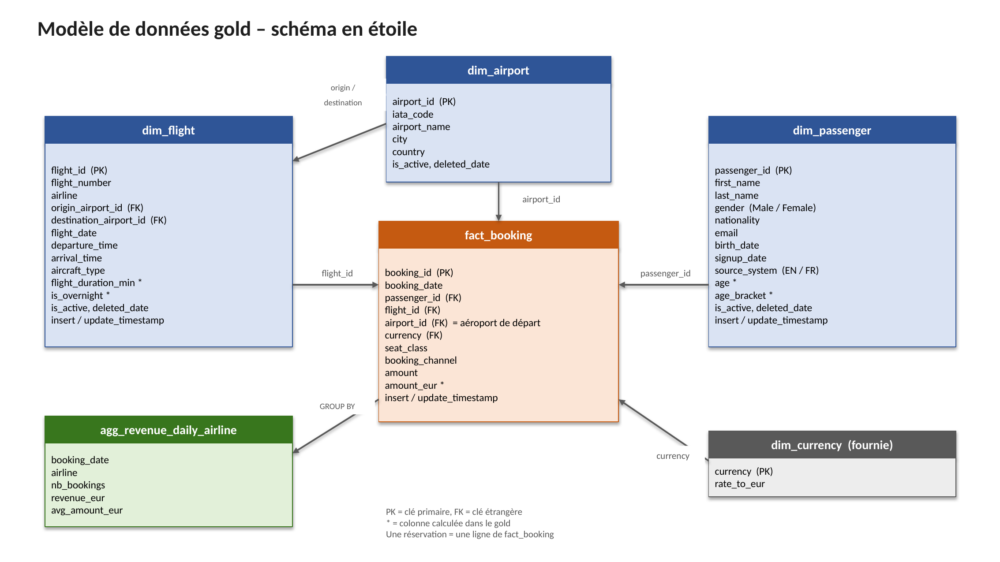

# TP Ingénierie des données – Documentation

Oumou MARIKO – 5A ISia – TP fait seule

## Lancer le projet

```bash
python3 -m venv venv
source venv/bin/activate
pip install -r requirements.txt
python3 ingestion/run_month.py
```

Ça prend environ 1 minute, le temps de télécharger les 155 fichiers. À la fin on a le dossier
`bronze/` et la base `warehouse.duckdb`.

## Ce que j'ai observé dans les données

- Clés : `airport_id`, `flight_id`, `passenger_id` (`id_passager` en FR), `booking_id`.
- Aéroports, vols, passagers : le fichier du jour contient **tout**, pas seulement les nouveautés.
- Réservations : le fichier du jour contient **seulement** les réservations du jour.
- Les aéroports ne bougent presque pas. Les vols changent souvent et certains disparaissent.
  Les passagers augmentent chaque jour.
- Une réservation ne change jamais après sa création. C'est donc un évènement, donc la table de
  fait. Les vols, passagers et aéroports décrivent la réservation, ce sont les dimensions.
- Les fichiers passagers EN et FR n'ont pas le même format : noms de colonnes différents,
  `Male/Female` contre `Homme/Femme`, dates `2001-05-14` contre `14/05/2001`. Les ids ne se
  chevauchent pas.
- 117 vols sur 420 ont une heure d'arrivée avant l'heure de départ : ce sont des vols de nuit.
- Le `airport_id` d'une réservation est toujours l'aéroport de départ du vol.

## Modèle de données gold

Schéma en étoile : une table de fait `fact_booking` et 4 dimensions.



Le schéma est aussi dans `docs/modele_donnees.pptx`.

- `fact_booking` : une ligne = une réservation. Elle contient le montant et les clés vers les
  dimensions. J'ai laissé `seat_class` et `booking_channel` dedans : il n'y a que 4 valeurs
  chacune, ça ne vaut pas une table à part.
- `dim_flight` : les vols, plus la durée de vol `flight_duration_min` et `is_overnight` que je calcule.
- `dim_passenger` : les passagers EN et FR réunis, plus `age` et `age_bracket` que je calcule.
- `dim_airport` : les aéroports, c'est le code fourni par le prof.
- `dim_currency` : les taux de change, table fournie.
- `agg_revenue_daily_airline` : CA en euros et nombre de réservations par jour et par compagnie.

Colonnes calculées :

- Durée de vol = heure d'arrivée moins heure de départ, en minutes. Si l'arrivée est avant le
  départ c'est un vol de nuit, j'ajoute 24 h.
- Âge calculé au 30/09/2025, la fin de la période. Comme ça le résultat ne change pas quand on
  relance le pipeline. Tranches : `<18`, `18-24`, `25-34`, `35-44`, `45-54`, `55-64`, `65+`.
- `amount_eur = amount * rate_to_eur`, avec une jointure sur `dim_currency`.

La table d'agrégation est construite dans le `ingest_gold` des réservations, après `fact_booking`,
parce qu'elle a besoin de `fact_booking` et de `dim_flight`. Dans `run_month.py` le gold des
réservations passe en dernier, donc `dim_flight` est déjà prête.

## Insert ou upsert ?

- **Aéroports, vols, passagers : upsert.** Le fichier du jour contient tout, donc je compare avec la
  table : si la clé est nouvelle j'insère, si elle existe déjà je mets à jour. Si une clé n'est plus dans le fichier, je
  passe `is_active` à `false` et je remplis `deleted_date`. Je ne supprime jamais la ligne : à la fin
  du mois, 18 vols sont désactivés et 774 réservations portent dessus. Si je les supprimais, ces
  réservations n'auraient plus de vol.
- **Réservations : insert simple.** Rien à mettre à jour ni à désactiver. J'ai mis
  `ON CONFLICT DO NOTHING` pour pouvoir relancer le même jour sans doublons.

Passagers EN/FR : dans `ingest_silver`, je renomme les colonnes FR, je remplace `Homme/Femme` par
`Male/Female`, je convertis les dates au même format, puis je mets les deux fichiers dans une seule
table. Une colonne `source_system` dit si la ligne vient du fichier EN ou du fichier FR.

Colonnes techniques sur toutes les tables silver et gold : `insert_timestamp`, la première fois
qu'on voit la ligne, et `update_timestamp`, mis à jour à chaque upsert ou désactivation.

## Vérifications

Les chiffres correspondent à la version des données du 25/09/2026. Le dépôt de données a été mis à
jour pendant le TP, donc ils peuvent changer si les données changent encore.

- Pipeline complet sans erreur, testé sur deux machines depuis un clone propre.
- Résultat : 81 aéroports, 714 vols dont 18 désactivés, 2 221 passagers dont 7 désactivés,
  38 930 réservations.
- 0 réservation sans vol, sans passager ou sans aéroport.
- Relancer deux fois le dernier jour ne change rien.
- Les 9 requêtes de `sql/analysis/queries_analyse.sql` tournent toutes sur le modèle.

## Limites

- Je ne garde que la dernière version d'un vol ou d'un passager. Je n'ai pas l'historique des
  changements. Pour l'avoir il faudrait faire du SCD2 comme vu en cours, c'est le bonus.
- `update_timestamp` change à chaque passage même si les valeurs n'ont pas bougé. C'est comme ça
  que marche le code fourni pour les aéroports et j'ai gardé la même logique.
- Il faut rejouer les jours dans l'ordre. Rejouer un ancien jour après un plus récent reviendrait en
  arrière.
- Les taux de change sont fixes, donc `amount_eur` est approximatif.
- L'âge est calculé à une date fixe et pas à la date de la réservation.
- Je n'ai pas fait de dimension date. Les fonctions de date de DuckDB suffisent pour les analyses
  demandées.
